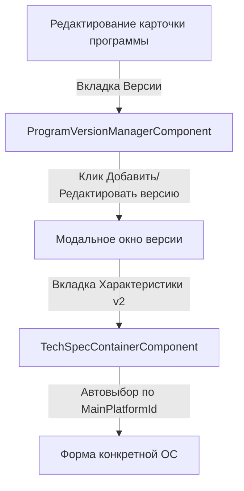

# Актуализированный план и бизнес-логика: Технические характеристики ПО (TechSpecs v2)

Этот документ описывает упрощенный и оптимизированный план создания, интеграции и бизнес-логики UI-компонентов для управления техническими характеристиками (Technical Specifications v2) в модуле **Агрегатора программ**.

---

## 1. Архитектурная концепция и привязка к платформе карточки

В отличие от первоначального плана с вкладками для всех ОС в одной версии, новая концепция строится на **строгой привязке формы к основной платформе программы** (`MainPlatformId`):
1. **Каждой ОС — своя карточка**: Программы для разных ОС (например, Chrome Win и Chrome Mac) ведутся как разные записи в БД со своими уникальными ID.
2. **Одна карточка — одна форма**: Внутри модального окна версии отображается **только одна** форма технических требований, соответствующая `MainPlatformId` текущей карточки.
3. **Отсутствие вложенных вкладок**: Оператор не переключается между вкладками систем внутри версии. Интерфейс становится чистым, понятным и избавленным от лишних кликов.

---

## 2. Структура UI-компонентов

Мы разделяем интерфейс на модульные компоненты для максимальной чистоты кода:

### 2.1 Контейнер: `TechSpecContainerComponent`
Простой переключатель (свитчер), который встраивается во вкладку **"Технические характеристики"** модального окна редактирования версии программы.
* **Входные параметры (Inputs)**:
  * `mainPlatformId: number` — ID основной платформы программы (берется из карточки).
  * `parentForm: FormGroup` — ссылка на реактивную форму версии из `ProgramVersionManagerComponent`.
* **Логика работы**:
  * В шаблоне используется стандартная конструкция `@switch (mainPlatformId)` для отрисовки формы под конкретную ОС.
  * Инициализирует реактивную подгруппу (`FormGroup`) только для активной платформы текущей карточки и передает её в дочерний компонент.

```html
<!-- Шаблон TechSpecContainerComponent -->
<div class="tech-spec-form-container">
  @switch (mainPlatformId) {
    @case (PlatformIds.Windows) {
      <app-windows-tech-spec-form [formGroup]="$any(parentForm.get('windowsSpec'))"></app-windows-tech-spec-form>
    }
    @case (PlatformIds.MacOS) {
      <app-macos-tech-spec-form [formGroup]="$any(parentForm.get('macOsSpec'))"></app-macos-tech-spec-form>
    }
    @case (PlatformIds.Linux) {
      <app-linux-tech-spec-form [formGroup]="$any(parentForm.get('linuxSpec'))"></app-linux-tech-spec-form>
    }
    @case (PlatformIds.Android) {
      <app-android-tech-spec-form [formGroup]="$any(parentForm.get('androidSpec'))"></app-android-tech-spec-form>
    }
    @case (PlatformIds.Ios) {
      <app-ios-tech-spec-form [formGroup]="$any(parentForm.get('iosSpec'))"></app-ios-tech-spec-form>
    }
  }
</div>
```

### 2.2 Общие поля формы: `BaseTechSpecFieldsComponent`
Вспомогательный компонент, содержащий форму для редактирования общих полей, наследуемых от `BaseTechSpec`. Переиспользуется внутри формы каждой ОС.
* **Редактируемые поля**:
  * **Финансы**: Тип лицензии (выпадающий список на основе `LicenseTypeOfAggregator`), цена и валюта.
  * **Файлы**: Размер файла (МБ), размер после установки (МБ), поддерживаемые архитектуры (мультиселектор тегов: `x86`, `x64`, `ARM64` и др.).
  * **Особенности (свитчи)**: `IsPortable`, `HasAutoUpdate`, `IsOpenSource` (показывает текстовое поле `SourceCodeUrl` при значении `true`), `RequiresInternet`, `SupportsOffline`, `InAppPurchases`.
  * **Локализация**: Поддерживаемые языки интерфейса (мультиселектор на основе справочника языков).

### 2.3 Компоненты специализированных форм
Индивидуальные формы для параметров каждой операционной системы, которые включают в себя `BaseTechSpecFieldsComponent` и добавляют специфичные поля:

1. **`WindowsTechSpecFormComponent`**
   * Минимальная версия Windows (селектор из справочника `PlatformOsVersionOfAggregator` с фильтром по коду `windows`).
   * Требования к железу (`MinRamMb`, `MinDiskMb`, `MinCpu`).
   * Зависимости (`RequiresDotNet`, `RequiresVcRedist` (свитч), `RequiresDirectX`, `RequiresAdminRights` (свитч)).
   * Опции установки и UI (`SupportsSilentInstall`, `SupportsHighDpi`, `SupportsTouchscreen`).
   * Менеджеры пакетов (`InstallerType` (MSI/EXE/MSIX/Winget...), `WingetId`, `ChocolateyId`, `ScoopBucket`).
   * Данные Microsoft Store (`HasWindowsStore`, `StoreId`, `StoreUrl`).

2. **`MacOsTechSpecFormComponent`**
   * Минимальная версия macOS (`MinOsVersionId` с фильтром по коду `macos`).
   * Требования к ОЗУ и диску (`MinRamMb`, `MinDiskMb`).
   * Архитектуры Apple Silicon & Intel (`SupportsAppleSilicon`, `SupportsIntel`, `IsUniversalBinary`, `RequiresRosetta`).
   * Безопасность (`IsSandboxed`, `IsNotarized`).
   * Способы дистрибуции (`InstallerType` (DMG/PKG/ZIP/Homebrew...), `HomebrewCask`).
   * Mac App Store (`HasAppStore`, `AppStoreId`, `AppStoreUrl`).

3. **`LinuxTechSpecFormComponent`**
   * Окружение ОС: поддерживаемые дистрибутивы (ввод тегов: `Ubuntu`, `Fedora`), графические окружения (`GNOME`, `KDE`), системные зависимости (`Dependencies`).
   * Графика (`SupportsWayland`, `RequiresX11`).
   * Форматы пакетов (`PackageFormats` — битовая маска, Flatpak ID `FlatpakId`, Snap Name `SnapName`).
   * Ссылки на пакеты (`DebUrl`, `RpmUrl`, `AppImageUrl`).

4. **`AndroidTechSpecFormComponent`**
   * Версии ОС: минимальная версия (`MinOsVersionId`), API Level (`MinSdkVersion`, `TargetSdkVersion`).
   * Google Play (`GooglePlayId`, `GooglePlayUrl`, возрастной рейтинг `AgeRating`).
   * Прямой APK (`HasApkDownload`, `ApkUrl`).
   * Форм-факторы (`SupportsAndroidTv`, `SupportsWearOs`, `SupportsChromebook`, `SupportsFoldable`).
   * Системные особенности (`RequiresGoogleServices` (GMS), `HasAdaptiveIcon`, разрешения `PermissionsRequired` (JSON)).

5. **`IosTechSpecFormComponent`**
   * Минимальная версия iOS (`MinOsVersionId`).
   * Поддержка устройств (`SupportsIphone`, `SupportsIpad`, `SupportsAppleWatch`, `SupportsAppleTv`).
   * App Store (`AppStoreId`, `AppStoreUrl`, возрастной рейтинг `AgeRating`).
   * Системные фичи Apple (`HasWidgets`, `HasSiriIntegration`, `HasICloudSync`, `HasFamilySharing`, `HasLiveActivities`, `HasShareExtension`).
   * Требуемые разрешения (JSON-список).

---

## 3. Новые UX-фичи для повышения удобства работы

Для того чтобы сделать работу оператора максимально комфортной и быстрой, мы заложим следующие умные функции:

### 3.1 Клонирование характеристик из предыдущей версии
Чаще всего при создании новой версии (например, обновление с версии `1.5` на `1.6`) технические требования программы **не меняются** или меняются незначительно.
* **Бизнес-логика**: При создании новой версии во вкладке характеристик отображается кнопка **"Скопировать требования из предыдущей версии"**.
* **Как работает**: Система запрашивает параметры предыдущей версии этой же программы и автоматически заполняет все поля формы. Оператору остается только изменить номер версии и нажать "Сохранить", что сокращает время работы до нескольких секунд.

### 3.2 Сериализация сложных полей
* На фронтенде пользователь работает с удобными массивами тегов и мультиселекторами (для полей языков, архитектур и доступов).
* При инициализации формы данные автоматически парсятся из JSON-строк в JS-массивы.
* Перед отправкой формы на сервер (в методе сохранения версии) массивы сериализуются обратно в JSON-строки (`JSON.stringify(array)`).

---

## 4. Схема интеграции

Интеграция выполняется исключительно просто и органично:



### 4.1 Изменения в `ProgramVersionManagerComponent`

1. **Добавление вкладки в шаблон**:
   ```html
   <nz-tab nzTitle="Технические характеристики" [nzDisabled]="!currentVersionId">
     <div class="modal-tab-content">
       @if (currentVersionId) {
         <app-tech-spec-container
           [mainPlatformId]="mainPlatformId"
           [parentForm]="versionForm"
         >
         </app-tech-spec-container>
       } @else {
         <nz-empty nzNotFoundContent="Сохраните версию, чтобы управлять характеристиками"></nz-empty>
       }
     </div>
   </nz-tab>
   ```

2. **Инициализация реактивной формы**:
   Мы добавляем в родительскую форму `versionForm` одну группу, соответствующую платформе карточки:
   ```typescript
   this.versionForm = this.fb.group({
     id: [null],
     programOfAggregatorId: [null],
     versionNumber: ['', [Validators.required]],
     releasedAt: [null],
     isLatest: [false],
     sortOrder: [0],
     externalChangelogUrl: [''],
     status: [0],
     localizations: this.fb.array([]),
     
     // Вложенные спецификации (будет заполнена только одна группа)
     windowsSpec: null,
     macOsSpec: null,
     iosSpec: null,
     androidSpec: null,
     linuxSpec: null
   });
   ```

3. **Загрузка и отправка данных**:
   * При редактировании версии метод `editVersion` делает `patchValue` для всех спецификаций. Но так как бэкенд вернет заполненным только одно поле (например, `windowsSpec`), то заполнится только нужная группа формы.
   * При сохранении метод `saveVersion` считывает `versionForm.value` и отправляет его на бэкенд. Так как остальные спецификации равны `null`, бэкенд сохранит именно ту спецификацию, которая соответствует платформе карточки.

---

## 5. План разработки компонентов

* **Шаг 1: Обновление TS моделей**
  Добавить интерфейсы спецификаций в файл [program-of-aggregator.model.ts](file:///d:/_PROGECT/pr_aurora_admin/src/app/AGREGATOR/PAGES/SPRAVKA/ProgramOfAggregatorPage/models/program-of-aggregator.model.ts) и расширить `VersionOfAggregatorDetail`.

* **Шаг 2: Создание общего компонента полей**
  Реализовать `BaseTechSpecFieldsComponent` для общих характеристик ПО.

* **Шаг 3: Разработка индивидуальных форм систем**
  Создать 5 компонентов форм под каждую ОС (Windows, macOS, Linux, Android, iOS) со справочниками минимальных версий ОС.

* **Шаг 4: Создание контейнера `TechSpecContainerComponent`**
  Реализовать автопереключение с помощью `@switch` на основе `mainPlatformId`. Внедрить кнопку копирования характеристик из предыдущей версии программы.

* **Шаг 5: Интеграция в модалку**
  Заменить старую вкладку требований новой, проверить реактивную связку и полное сохранение формы.

---

## 6. Подробный чек-лист по реализации

Ниже приведен интерактивный чек-лист, который поможет разработчику последовательно и качественно внедрить всю бизнес-логику шаг за шагом.

### 6.1 Шаг 1: TypeScript-модели и DTO (Frontend)
- [x] Создать новый файл моделей [tech-spec.model.ts](file:///d:/_PROGECT/pr_aurora_admin/src/app/AGREGATOR/PAGES/TechSpec/tech-spec.model.ts) внутри папки [TechSpec](file:///d:/_PROGECT/pr_aurora_admin/src/app/AGREGATOR/PAGES/TechSpec) и описать в нем:
  - [x] Базовый интерфейс `BaseTechSpecDto` с общими полями (размеры, цены, лицензии, чекбоксы).
  - [x] Специфические DTO для каждой платформы: `WindowsTechSpecDto`, `MacOsTechSpecDto`, `LinuxTechSpecDto`, `AndroidTechSpecDto`, `IosTechSpecDto`.
- [x] В файле [program-of-aggregator.model.ts](file:///d:/_PROGECT/pr_aurora_admin/src/app/AGREGATOR/PAGES/SPRAVKA/ProgramOfAggregatorPage/models/program-of-aggregator.model.ts) импортировать созданные спецификации из `TechSpec/tech-spec.model`.
- [x] Добавить в интерфейс `VersionOfAggregatorDetail` свойства:
  - `windowsSpec?: WindowsTechSpecDto | null`
  - `macOsSpec?: MacOsTechSpecDto | null`
  - `linuxSpec?: LinuxTechSpecDto | null`
  - `androidSpec?: AndroidTechSpecDto | null`
  - `iosSpec?: IosTechSpecDto | null`
- [x] Добавить аналогичные опциональные поля в DTO создания/обновления версии (`VersionOfAggregatorCreate`/`VersionOfAggregatorUpdate`).

### 6.2 Шаг 2: Общие поля спецификаций (`BaseTechSpecFieldsComponent`)
- [x] Сгенерировать standalone-компонент `BaseTechSpecFieldsComponent` в папке [TechSpec](file:///d:/_PROGECT/pr_aurora_admin/src/app/AGREGATOR/PAGES/TechSpec).
- [x] Подключить `ReactiveFormsModule` и модули UI компонентов Ng-Zorro (`nz-select`, `nz-switch`, `nz-input`, `nz-form`).
- [x] Реализовать реактивную форму для общих параметров с валидацией:
  - [x] Селектор `LicenseTypeId` (динамическая загрузка с сервиса лицензий).
  - [x] Поля цены (`Price`) и валюты (`Currency`). *Сделать валидацию: если выбран платный тип лицензии, цена становится обязательной.*
  - [x] Поля размеров файлов (`FileSizeMb`, `InstalledSizeMb`) с типом `number`.
  - [x] Мультиселектор тегов архитектур `Architecture` (массив строк `["x64", "ARM64"]`).
  - [x] Набор чекбоксов/свитчей (`IsPortable`, `HasAutoUpdate`, `IsOpenSource`, `RequiresInternet`, `SupportsOffline`, `InAppPurchases`). *Если IsOpenSource == true, показывать текстовое поле `SourceCodeUrl`.*
  - [x] Мультиселектор `SupportedLanguages` (загрузка справочника языков).

### 6.3 Шаг 3: Разработка форм для ОС
- [x] **Windows**: Создать `WindowsTechSpecFormComponent`.
  - [x] Подключить `BaseTechSpecFieldsComponent` для общих полей.
  - [x] Реализовать селектор минимальной ОС `MinOsVersionId` (запрос версий с фильтром `PlatformId` для Windows).
  - [x] Сделать поля системных параметров (`MinRamMb`, `MinDiskMb`, `MinCpu`, свитчи `RequiresVcRedist`, `RequiresAdminRights`).
  - [x] Добавить секцию пакетных менеджеров (`InstallerType` селектор, `WingetId`, `ChocolateyId`, `ScoopBucket`).
  - [x] Добавить секцию Microsoft Store (`HasWindowsStore`, `StoreId`, `StoreUrl`).
- [x] **macOS**: Создать `MacOsTechSpecFormComponent`.
  - [x] Селектор версий macOS (`MinOsVersionId`).
  - [x] ОЗУ, Диск, свитчи процессоров (`SupportsAppleSilicon`, `SupportsIntel`, `IsUniversalBinary`, `Rosetta`).
  - [x] Песочница и нотаризация (`IsSandboxed`, `IsNotarized`).
  - [x] Установщик (`InstallerType`, `HomebrewCask`, `HasAppStore`, `AppStoreId`, `AppStoreUrl`).
- [x] **Linux**: Создать `LinuxTechSpecFormComponent`.
  - [x] Ввод списков дистрибутивов (`SupportedDistributions`) и графических окружений (`DesktopEnvironments`) через теги.
  - [x] Свитчи дисплейного сервера (`Wayland`, `X11`), битовая маска форматов (`PackageFormats`).
  - [x] Данные пакетов (`FlatpakId`, `SnapName`, прямые ссылки `.deb`, `.rpm`, `AppImage`).
- [x] **Android**: Создать `AndroidTechSpecFormComponent`.
  - [x] Версия ОС (`MinOsVersionId`), API Level (`MinSdkVersion`, `TargetSdkVersion`).
  - [x] Google Play (`GooglePlayId`, `GooglePlayUrl`, свитч Google Services, возрастной рейтинг).
  - [x] Прямой APK (`HasApkDownload`, `ApkUrl`), чекбоксы устройств (Android TV, Wear OS).
  - [x] Ввод разрешений `PermissionsRequired` (мультиселектор тегов).
- [x] **iOS**: Создать `IosTechSpecFormComponent`.
  - [x] Версия iOS (`MinOsVersionId`), чекбоксы устройств (iPhone, iPad, Apple Watch, Catalyst, Apple TV).
  - [x] App Store (`AppStoreId`, `AppStoreUrl`, возрастной рейтинг).
  - [x] Чекбоксы возможностей (Widgets, Siri, iCloud, Family Sharing, Live Activities).
  - [x] Ввод разрешений `PermissionsRequired` (мультиселектор тегов).

### 6.4 Шаг 4: Разработка контейнера и логики клонирования
- [x] Создать `TechSpecContainerComponent`.
  - [x] Описать в шаблоне `@switch (mainPlatformId)` для вывода нужной дочерней формы.
  - [x] Добавить в API-сервис метод для получения деталей конкретной версии программы по `versionId`.
  - [x] **Клонирование**: Разместить кнопку **"Скопировать требования из прошлой версии"**.
    - [x] Логика: Запросить список всех версий программы. Найти предыдущую по `sortOrder` / `releasedAt`.
    - [x] Запросить детали прошлой версии по её ID.
    - [x] Заполнить (`patchValue`) форму текущей спецификации данными из прошлой версии.
    - [x] Показать сообщение об успешном копировании (`NzMessageService`).

### 6.5 Шаг 5: Интеграция в модалку и тестирование
- [x] Добавить в FormGroup `versionForm` в [ProgramVersionManagerComponent](file:///d:/_PROGECT/pr_aurora_admin/src/app/AGREGATOR/PAGES/SPRAVKA/ProgramOfAggregatorPage/components/program-version-manager/program-version-manager.component.ts#L318) вложенные null-объекты спецификаций (`windowsSpec`, `macOsSpec`, `linuxSpec`, `androidSpec`, `iosSpec`).
- [x] Обновить метод `editVersion(id)` для загрузки спецификаций с бэкенда и наполнения формы при редактировании.
- [x] Заменить старый компонент требований `<app-system-requirement-manager>` на новый `<app-tech-spec-container>` во вкладке **"Технические характеристики"**.
- [x] Запустить локальный сервер и провести сквозное тестирование:
  - [x] Создать новую версию, заполнить характеристики ОС карточки, сохранить. Убедиться, что в БД записались данные именно для нужной ОС.
  - [x] Открыть версию на редактирование, проверить корректное отображение полей и списков тегов.
  - [x] Изменить характеристики, сохранить, проверить перезапись в БД.
  - [x] Проверить работу кнопки "Скопировать требования из прошлой версии".
