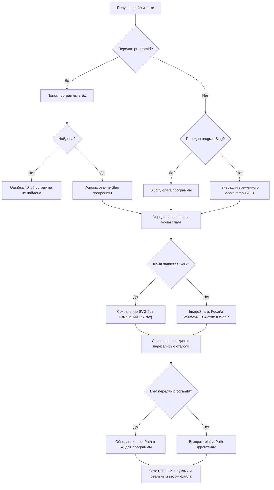

# Специфичный Модуль Загрузки и Управления Иконками Программ Агрегатора

Данный документ описывает специализированную подсистему для работы с иконками программ агрегатора **Aurora**, реализованную в соответствии с архитектурным стандартом **v3.5**. Этот модуль заменяет универсальный Base64-загрузчик на оптимизированное двоичное решение, жестко интегрированное с соглашением о путях (Naming Convention) и базой данных.

---

## 1. Архитектурное соглашение о путях (Naming & Storage Convention)

Для обеспечения высокой масштабируемости файловой системы и предотвращения снижения производительности ОС при чтении каталогов с большим количеством файлов, иконки программ распределяются по «шардам» на основе первой буквы системного слага (ЧПУ) программы.

* **Корневая папка на сервере**: `wwwroot/argregator_icons/programs/icons/`
* **Шаблон пути**: `/argregator_icons/programs/icons/{первая_буква_слага}/{slug_программы}.{расширение}`
* **Пример распределения**:
  * Программа со слагом `notepad` ➔ `/argregator_icons/programs/icons/n/notepad.webp`
  * Программа со слагом `7-zip` ➔ `/argregator_icons/programs/icons/7/7-zip.webp`
  * Программа со слагом `photoshop` ➔ `/argregator_icons/programs/icons/p/photoshop.webp`

---

## 2. Сжатие и Оптимизация Изображений (WebP & SVG)

Чтобы обеспечить максимальную скорость загрузки страниц каталога программ (где одновременно могут отображаться десятки иконок), модуль реализует строгую стратегию оптимизации:

* **⚡ Использование ультра-легкого формата WebP**:
  Все растровые форматы изображений (PNG, JPG, WebP, BMP, TIFF), переданные пользователем, принудительно пережимаются и сохраняются в формате **WebP** с качеством **85%** и максимальным сжатием (`WebpEncoder`). Это снижает средний вес иконки до **5–12 КБ** (в 5-10 раз легче PNG!), сохраняя прозрачность и кристальную четкость.
* **📐 Нормализация размера (256x256)**:
  Все растровые изображения автоматически ресайзятся до стандартного квадратного разрешения **256x256 пикселей** с использованием `ResizeMode.Crop` (умное заполнение квадрата).
* **🎨 Сохранение векторного качества (SVG)**:
  Если исходный файл имеет формат `.svg`, он сохраняется в исходном виде **«как есть»**, не растроризуясь и не теряя преимуществ бесконечного масштабирования вектора.

---

## 3. Спецификация Backend API (`ProgramIconController`)

Контроллер [ProgramIconController.cs](file:///d:/_PROGECT/pr_srv_names/Project_Server_Auth/Controllers/ProgramIconController.cs) обрабатывает запросы по базовому адресу **`api/v1/aggregator/programs/icons`** и требует авторизации (`[Authorize]`). Он работает с бинарными потоками данных (`multipart/form-data`), оптимизируя потребление памяти на сервере.

### 3.1. Загрузка/Обновление иконки
* **Эндпоинт**: `POST /upload`
* **Тип контента**: `multipart/form-data`
* **Параметры формы (`[FromForm]`)**:
  * `file` (обязательный, `IFormFile`) — файл изображения.
  * `programId` (опциональный, `int?`) — идентификатор существующей программы.
  * `programSlug` (опциональный, `string?`) — планируемый слаг для новой программы.

#### Логика работы эндпоинта:


* **Пример успешного ответа (200 OK)**:
  ```json
  {
    "fileName": "notepad.webp",
    "relativePath": "argregator_icons/programs/icons/n/notepad.webp",
    "fullUrl": "https://localhost:7233/argregator_icons/programs/icons/n/notepad.webp",
    "size": 7450
  }
  ```

### 3.2. Удаление иконки программы
* **Эндпоинт**: `DELETE /{programId:int}`
* **Логика работы**:
  1. Выполняет поиск программы в БД. Если не найдена ➔ возвращает `404 NotFound`.
  2. Считывает текущее значение `IconPath`.
  3. Физически удаляет соответствующий файл с диска сервера.
  4. Записывает `null` в поле `IconPath` программы в БД и сохраняет изменения.
* **Результат**: `204 NoContent`.

---

## 4. Двухформатная Синхронизация (`UniversalMediaService`)

Метод фоновой синхронизации иконок `SyncIconsByConventionAsync()` в [UniversalMediaService.cs](file:///d:/_PROGECT/pr_srv_names/Project_Server_Auth/Pages/AGGREGATOR/UniversalMedia/Services/UniversalMediaService.cs) модернизирован для поддержки мультиформатности. 

Он сначала ищет иконку в современном формате **`.webp`**, а если она отсутствует на диске — осуществляет плавный откат к поиску старого формата **`.png`**. Это позволяет плавно мигрировать со старых иконок на новые без сбоев в работе планировщика:

```csharp
var webpConventionPath = $"argregator_icons/programs/icons/{firstLetter}/{program.Slug}.webp";
var pngConventionPath = $"argregator_icons/programs/icons/{firstLetter}/{program.Slug}.png";

string? selectedPath = null;
if (File.Exists(physicalWebpPath))
    selectedPath = webpConventionPath;
else if (File.Exists(physicalPngPath))
    selectedPath = pngConventionPath;
```

---

## 5. Руководство по интеграции с фронтендом (Angular)

При использовании данного контроллера отпадает необходимость в конвертации файлов в Base64 на клиенте. Загрузка происходит через стандартный `FormData`.

### 5.1. Создание специализированного сервиса загрузки
Рекомендуется реализовать специализированный сервис [ProgramIconService](file:///d:/_PROGECT/pr_aurora_admin/src/app/core/services/program-icon.service.ts) на клиенте:

```typescript
import { inject, Injectable } from '@angular/core';
import { HttpClient } from '@angular/common/http';
import { Observable } from 'rxjs';
import { environment } from '@environments/environment';

export interface IconUploadResponse {
  fileName: string;
  relativePath: string;
  fullUrl: string;
  size: number;
}

@Injectable({
  providedIn: 'root'
})
export class ProgramIconService {
  private http = inject(HttpClient);
  private apiUrl = `${environment.api.baseUrl}/v1/aggregator/programs/icons`;

  /**
   * Загрузить иконку для существующей программы или в процессе её создания
   */
  uploadIcon(file: File, programId?: number, programSlug?: string): Observable<IconUploadResponse> {
    const formData = new FormData();
    formData.append('file', file);
    
    if (programId) {
      formData.append('programId', programId.toString());
    }
    if (programSlug) {
      formData.append('programSlug', programSlug);
    }

    return this.http.post<IconUploadResponse>(`${this.apiUrl}/upload`, formData);
  }

  /**
   * Удалить иконку программы
   */
  deleteIcon(programId: number): Observable<void> {
    return this.http.delete<void>(`${this.apiUrl}/${programId}`);
  }
}
```

### 5.2. Интеграция в форму редактирования/добавления программы

При выборе файла пользователем в интерфейсе (например, через `<input type="file">` или Drag-and-Drop) код компонента отправляет файл на сервер:

```typescript
// Внутри компонента program-form.component.ts
onIconFileSelected(event: Event): void {
  const input = event.target as HTMLInputElement;
  const file = input.files?.[0];
  if (!file) return;

  this.isIconUploading = true;
  const programId = this.programForm.value.id; // Может быть undefined при создании
  const currentSlug = this.programForm.value.slug;

  this.programIconService.uploadIcon(file, programId, currentSlug).subscribe({
    next: (res) => {
      // Обновляем путь иконки в форме
      this.programForm.patchValue({ iconPath: res.relativePath });
      this.iconPreviewUrl = res.fullUrl;
      this.isIconUploading = false;
      this.message.success('Иконка успешно обновлена!');
    },
    error: (err) => {
      this.isIconUploading = false;
      this.message.error('Не удалось загрузить иконку: ' + err.message);
    }
  });
}
```

---

## 6. Преимущества специализированного WebP-решения перед универсальным

1. **Экстремальное сжатие (WebP)**:
   Размер файла иконки составляет всего **5-12 КБ** вместо 50-200 КБ в формате PNG. Это экономит до **90% сетевого трафика** и кратно повышает отзывчивость веб-страниц каталога программ при медленном мобильном интернете.
2. **Бинарный двоичный стриминг**:
   В отличие от универсального Base64 загрузчика, исключены ресурсоемкие операции кодирования на клиенте и декодирования на сервере. Файлы передаются напрямую.
3. **Гарантированное именование по соглашению**:
   Файлы именуются в строгом соответствии с ЧПУ-слагом программы и распределяются по алфавитным директориям, поддерживая идеальный порядок в файловой системе.
4. **Интеллектуальное управление БД**:
   Загрузка через контроллер сама связывает путь к иконке с конкретной программой в БД, избавляя клиентское приложение от отправки повторных запросов на обновление.
5. **Безопасность перезаписи**:
   При повторной загрузке старый файл WebP автоматически перезаписывается, полностью исключая накапливание неиспользуемых "сиротских" медиафайлов на сервере.
