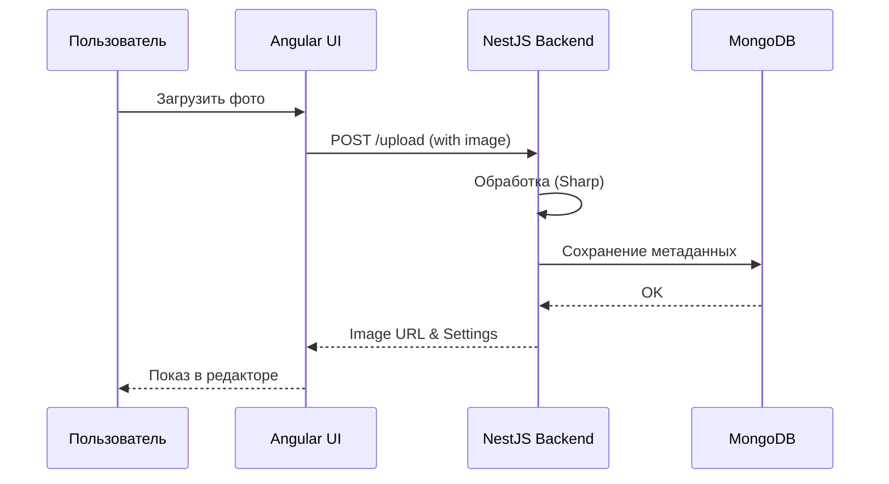

# 🎨 Креативная верстка в Markdown: Гайд для Aurora Admin

Нажми в VS Code комбинацию Ctrl + Shift + V, чтобы открыть окно предпросмотра (Preview). Ты увидишь, что:
Текст покрасился.
Клавиши Ctrl выглядят как кнопки.
Текст выровнялся по центру.

Этот файл — не просто список тегов, а демонстрация того, как сделать документацию **живой**, **структурированной** и **интерактивной**.

---

## 🏗️ 1. Модульная структура (Alerts & Callouts)

В стандартном Markdown нет "алертов", но их можно имитировать через цитаты с эмодзи или HTML-блоки.

> [!IMPORTANT]
> **Важное замечание:** Используйте этот блок для акцентирования внимания на критических деталях архитектуры.

> [!TIP]
> **Совет:** Для быстрой навигации в VS Code используйте `Ctrl + Shift + O`.

---

## 📊 2. Сравнения и функциональные таблицы

Таблицы отлично подходят для ТЗ и описания API.

| Feature          | Статус | Компонент       | Priority | Примечание              |
| :--------------- | :----: | :-------------- | :------: | :---------------------- |
| **Auth System**  |   ✅   | `AuthService`   |    🔴    | Сделано через JWT       |
| **Image Editor** |   🏗️   | `AvImageEditor` |    🟡    | В процессе рефакторинга |
| **Analytics**    |   📅   | `StatsModule`   |    🟢    | Запланировано на Q3     |

---

## 🧩 3. Детализация и интерактив (HTML внутри MD)

Markdown отлично "переваривает" HTML-теги для создания сложных UI-элементов.

### Скрытые блоки (для логов или больших кусков кода)

<details>
<summary><b>▶ Нажми, чтобы развернуть конфигурацию TinyMCE</b></summary>

```javascript
{
  selector: 'textarea',
  plugins: 'av-youtube av-image-editor',
  toolbar: 'undo redo | bold italic | av-youtube'
}
```

</details>

### Кнопки и Индикаторы (Badge)

Можно использовать сервисы вроде Shields.io для динамических статусов:


---

## 🔄 4. Визуализация логики (Mermaid)

Диаграммы прямо в коде — это мощно. VS Code отлично их рендерит.



---

## 💻 5. Код с контекстом

Не забывайте указывать язык для подсветки синтаксиса и делать комментарии.

```typescript
/**
 * Пример функции рефакторинга UI
 * @param componentName Имя компонента Aurora
 */
function refactorComponent(componentName: string): void {
  console.log(`🚀 Начинаем рефакторинг ${componentName}...`);
  // TODO: внедрить AvShowcaseComponent
}
```

---

## 🎨 6. Стилизация текста через HTML

Если стандартных `**bold**` не хватает:

- **Цветной акцент:** <span style="color: #e74c3c; font-weight: bold;">Критическая ошибка</span>
- **Маркеры:** <mark>Обратить внимание на этот метод</mark>
- **Клавиши:** Нажмите <kbd>F12</kbd> для вызова консоли.

---

## 📂 7. Навигация по файлам (Tree View)

Для описания структуры проекта удобно использовать блоки кода:

```text
src/
├── app/
│   ├── core/           # Глобальные сервисы
│   ├── shared/         # Общие компоненты
│   └── features/       # Функциональные модули
└── assets/
    └── controls/       # Кастомные контролы (TinyMCE и др.)
```

---

## 📝 Обсудим?

Этот формат документации позволяет:

1.  **Экономить время**: Писать быстро, как текст.
2.  **Видеть результат**: Мгновенный рендер в IDE.
3.  **Версионность**: MD — это просто текст, он идеально ложится в Git.

Какие из этих элементов стоит внедрить в наш стандарт документации Aurora?

## 📂 8. Стили текста в формате .md

Markdown предоставляет гибкие возможности для оформления текста: от стандартного форматирования до использования HTML-тегов для более тонкой настройки.

### Стандартное форматирование

| Результат        | Синтаксис     | Описание                  |
| :--------------- | :------------ | :------------------------ |
| **Жирный текст** | `**текст**`   | Акцентирование внимания   |
| _Курсив_         | `*текст*`     | Выделение терминов        |
| ~~Зачеркнутый~~  | `~~текст~~`   | Устаревшая информация     |
| `Моноширинный`   | `` `текст` `` | Названия переменных, кода |

### Продвинутая стилизация (HTML-friendly)

Если стандартных средств недостаточно, можно использовать HTML внутри `.md`:

1.  **Выделение маркером:** `<mark>Важный текст</mark>` → <mark>Важный текст</mark>
2.  **Подчеркивание:** `<u>Подчеркнутый текст</u>` → <u>Подчеркнутый текст</u>
3.  **Клавиши и кнопки:** `<kbd>Ctrl</kbd> + <kbd>C</kbd>` → <kbd>Ctrl</kbd> + <kbd>C</kbd>
4.  **Цветной текст:**
    - `<span style="color:red">Красный</span>` → <span style="color:red">Красный</span>
    - `<span style="color:#27ae60">Зеленый (Custom Hex)</span>` → <span style="color:#27ae60">Зеленый (Custom Hex)</span>
5.  **Размер текста:**
    - `<small>Маленький текст (для дисклеймеров)</small>` → <small>Маленький текст (для дисклеймеров)</small>
    - `<big>Крупный текст</big>` → <big>Крупный текст</big>
6.  **Выравнивание (через параграф):**
    <p align="right">Текст по правому краю</p>
    <p align="center">Текст по центру</p>

### Индексы

- **Верхний индекс:** `x<sup>2</sup>` → x<sup>2</sup>
- **Нижний индекс:** `H<sub>2</sub>O` → H<sub>2</sub>O
