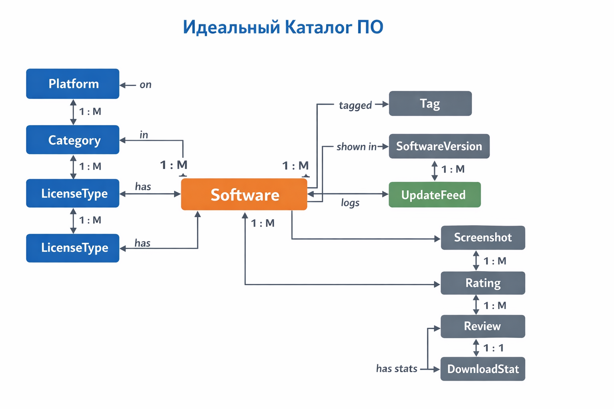

Вот строго унифицированная ER-схема “идеального каталога” на основе всех этих примеров — без кода, без воды, только рубрики → модели → связи → API:


схема связей картинка в текущем каталоге -- @docs\▬ агрегатор программ\тз агрегатор\00.png

## 1️⃣ Рубрики

- **Platform** — операционная система или среда (Windows, macOS, Linux и т.д.)
- **Category** — категория ПО (Browsers, Security, Multimedia…)
- **Software** — программа / продукт
- **SoftwareVersion** — версии ПО
- **LicenseType** — тип лицензии (Free, Trial, Paid)
- **Tag** — теги / ключевые слова
- **Screenshot** — скриншоты ПО
- **Rating** — оценки пользователей
- **Review** — обзоры / комментарии
- **DownloadStat** — статистика загрузок
- **UpdateFeed** — история обновлений

---

## 2️⃣ Ключевые модели

| Модель          | Описание                          |
| --------------- | --------------------------------- |
| Platform        | Платформа, на которой работает ПО |
| Category        | Рубрика / категория ПО            |
| LicenseType     | Тип лицензии                      |
| Software        | Конкретная программа              |
| SoftwareVersion | Конкретная версия программы       |
| Tag             | Метка / ключевое слово            |
| Screenshot      | Изображения программы             |
| Rating          | Пользовательская оценка           |
| Review          | Пользовательский отзыв            |
| DownloadStat    | Статистика загрузок программы     |
| UpdateFeed      | История обновлений версии         |

---

## 3️⃣ Базовые связи (ER)

- **Platform 1–M Software** — на одной платформе может быть много программ
- **Category 1–M Software** — в одной категории может быть много программ
- **Category 1–M Category** — иерархия категорий (CNET)
- **LicenseType 1–M Software** — один тип лицензии может быть у многих программ
- **Software 1–M SoftwareVersion** — у каждой программы может быть несколько версий
- **Software 1–M Screenshot** — каждая программа может иметь несколько скриншотов
- **Software M–N Tag** — многие программы могут иметь одни и те же теги
- **Software 1–M Rating** — оценки привязаны к программам
- **Software 1–M Review** — обзоры привязаны к программам
- **Software 1–1 DownloadStat** — статистика загрузок одной программы
- **SoftwareVersion 1–M UpdateFeed** — каждая версия может иметь несколько записей обновлений

---

## 4️⃣ API / Фильтрация

- **Список программ**: `/software`
- **Фильтры**: по `platform`, `category`, `tag`, `license`, `version`
- **Дополнительно**: получение `versions`, `screenshots`, `ratings`, `reviews`, `updates`, `downloadStats`

---

💡 **Комментарий:**

- Это максимально унифицированная модель, покрывающая все ключевые каталоги.
- Для MVP можно убрать `Review` и `UpdateFeed` → получится упрощённый FileHorse/Ninite стиль.
- Для масштабирования оставляем все связи и модели, включая иерархию категорий и M–N теги.

---

Если хочешь, я могу нарисовать **наглядную ER-схему в виде таблицы или диаграммы**, чтобы сразу видеть все связи. Это будет удобно для обсуждения с командой.

Хочешь, чтобы я это сделал?
Ок, сделаем максимально наглядную ER-схему в виде таблицы с моделями и связями:

---

### 🟦 Таблица ER “Идеальный каталог ПО”

| Модель              | Связи                                                                                                                                                                 | Комментарий                 |
| ------------------- | --------------------------------------------------------------------------------------------------------------------------------------------------------------------- | --------------------------- |
| **Platform**        | 1–M → Software                                                                                                                                                        | Платформа запуска ПО        |
| **Category**        | 1–M → Software<br>1–M → Category (подкатегории)                                                                                                                       | Категории и иерархия        |
| **LicenseType**     | 1–M → Software                                                                                                                                                        | Тип лицензии программ       |
| **Software**        | M–N → Tag<br>1–M → SoftwareVersion<br>1–M → Screenshot<br>1–M → Rating<br>1–M → Review<br>1–1 → DownloadStat<br>1–1 → Platform<br>1–1 → Category<br>1–1 → LicenseType | Основная сущность программы |
| **SoftwareVersion** | 1–M → UpdateFeed<br>1–1 → Software                                                                                                                                    | Конкретная версия программы |
| **Tag**             | M–N → Software                                                                                                                                                        | Теги / ключевые слова       |
| **Screenshot**      | 1–1 → Software                                                                                                                                                        | Скриншоты программы         |
| **Rating**          | 1–1 → Software                                                                                                                                                        | Оценка пользователей        |
| **Review**          | 1–1 → Software                                                                                                                                                        | Отзыв / обзор               |
| **DownloadStat**    | 1–1 → Software                                                                                                                                                        | Статистика загрузок         |
| **UpdateFeed**      | 1–1 → SoftwareVersion                                                                                                                                                 | История обновлений версии   |

---

### 🟩 Диаграмма-схема (текстовая, “ASCII ERD”)

```
Platform 1---M Software
Category 1---M Software
Category 1---M Category
LicenseType 1---M Software

Software M---N Tag
Software 1---M SoftwareVersion
Software 1---M Screenshot
Software 1---M Rating
Software 1---M Review
Software 1---1 DownloadStat

SoftwareVersion 1---M UpdateFeed
```

---

Если хочешь, я могу сделать **красивую визуальную диаграмму в стиле ERD с блоками и стрелками**, прямо как на проектных схемах, чтобы было похоже на UML-ERD.

Хочешь, чтобы я так сделал?

Окей, я создам все модели для идеального каталога ПО строго по нашей ER-схеме, с учётом связей. Сделаем это в виде TypeScript/Angular standalone моделей, без модулей, только сущности.

1️⃣ Platform
export interface Platform {
id: number;
name: string;
software?: Software[]; // 1:M
}

2️⃣ Category
export interface Category {
id: number;
name: string;
parentCategoryId?: number; // для иерархии
parentCategory?: Category;
subCategories?: Category[]; // 1:M
software?: Software[]; // 1:M
}

3️⃣ LicenseType
export interface LicenseType {
id: number;
name: string;
software?: Software[]; // 1:M
}

4️⃣ Tag
export interface Tag {
id: number;
name: string;
software?: Software[]; // M:N
}

5️⃣ Software
export interface Software {
id: number;
name: string;
description?: string;
platformId: number;
platform?: Platform;
categoryId: number;
category?: Category;
licenseTypeId: number;
licenseType?: LicenseType;
tags?: Tag[]; // M:N
versions?: SoftwareVersion[]; // 1:M
screenshots?: Screenshot[]; // 1:M
ratings?: Rating[]; // 1:M
reviews?: Review[]; // 1:M
downloadStat?: DownloadStat; // 1:1
}

6️⃣ SoftwareVersion
export interface SoftwareVersion {
id: number;
version: string;
releaseDate?: Date;
softwareId: number;
software?: Software;
updateFeeds?: UpdateFeed[]; // 1:M
}

7️⃣ UpdateFeed
export interface UpdateFeed {
id: number;
description: string;
date: Date;
softwareVersionId: number;
softwareVersion?: SoftwareVersion;
}

8️⃣ Screenshot
export interface Screenshot {
id: number;
url: string;
softwareId: number;
software?: Software;
}

9️⃣ Rating
export interface Rating {
id: number;
score: number; // 1-5
userId?: number;
softwareId: number;
software?: Software;
}

🔟 Review
export interface Review {
id: number;
userId?: number;
comment: string;
ratingId?: number;
softwareId: number;
software?: Software;
}

1️⃣1️⃣ DownloadStat
export interface DownloadStat {
id: number;
count: number;
softwareId: number;
software?: Software;
}
🔷 НОВЫЙ БЛОК: Обзорные статьи
1️⃣ Article (обзорная статья)

НЕ = Review
Review — отзыв о программе
Article — полноценная редакционная статья

export interface Article {
id: number;
title: string;
slug: string;
content: string;
publishedAt: Date;
authorId?: number;

relatedSoftware?: Software[]; // M:N
comments?: Comment[]; // 1:M
tags?: Tag[]; // M:N
}

2️⃣ Comment (комментарии)

Комментарии могут быть:

к статье

к программе
(универсальная модель)

export interface Comment {
id: number;
content: string;
createdAt: Date;
userId?: number;

articleId?: number; // комментарий к статье
softwareId?: number; // комментарий к ПО

parentCommentId?: number; // ответы (thread)
replies?: Comment[];
}

🔷 ОБНОВЛЕНИЕ СУЩЕСТВУЮЩИХ МОДЕЛЕЙ
Software (добавляем)
comments?: Comment[]; // 1:M
articles?: Article[]; // M:N

Tag (уже используется)
articles?: Article[]; // M:N

🧩 ОБНОВЛЁННЫЕ ER-СВЯЗИ
Article M---N Software
Article M---N Tag
Article 1---M Comment

Software 1---M Comment

Comment 1---M Comment (reply)

🧠 ЧЁТКОЕ РАЗДЕЛЕНИЕ ПОНЯТИЙ
Сущность Назначение
Review Короткий отзыв о ПО
Rating Оценка (1–5)
Article Обзор, гайд, сравнение
Comment Обсуждение статьи или ПО
🏗 ИТОГОВАЯ АРХИТЕКТУРА (уровни)

Каталог

Software

Versions

Ratings

Reviews

Downloads

Контент

Articles

Comments

Tags

Связка

Article ↔ Software

Comment ↔ Article / Software

Я реализовал универсальную систему SEO, которая теперь может быть подключена к любой сущности проекта. Это был важный архитектурный переход от жесткой привязки SEO к конкретным именам до гибкой компонентной модели.

Вот подробный отчет по проделанной работе:

1. Архитектурные изменения в Backend (DAL)
   Декаплинг
   SeoData
   : Сделал поля NameMainId и LanguageId в таблице SEO необязательными (int?). Теперь запись SEO может существовать сама по себе или быть привязана к чему угодно.
   Умные индексы: Обновил конфигурацию БД так, чтобы уникальность (Name + Language) проверялась только если эти поля заполнены. Это позволяет использовать одну и ту же таблицу
   SeoData
   для разных целей.
   Образцовая реализация (SampleMainSeo): Создал новые сущности
   SampleMainSeo
   и
   SampleMainDescriptionSeo
   . Они демонстрируют «идеальный» подход:
   Композиция вместо наследования: Теперь SEO-данные — это отдельный объект, связанный по SeoDataId, а не часть полей таблицы описания. Это экономит место (запись SEO создается только если она заполнена) и делает код чище.
   Каскадное удаление: Если вы удаляете описание на конкретном языке, связанные с ним SEO-теги удаляются автоматически.
2. Бизнес-логика (Services & Repositories)
   SampleMainSeoService
   : Реализовал сложную логику синхронизации. Когда вы сохраняете объект с переводами, сервис сам понимает:
   Нужно ли создать новую запись SEO.
   Нужно ли обновить существующую.
   Нужно ли удалить SEO, если пользователь очистил все мета-теги.
   Автоматизация маппинга: Настроил AutoMapper для работы с глубоко вложенными структурами (Entity -> DTO и обратно).
3. Frontend (Angular & UI)
   Компонент
   SeoFormComponent
   : Создал переиспользуемую форму на базе ng-zorro-antd. Она включает в себя:
   Основные теги: Title, Description, Keywords, URL Slug.
   Social Media: Настройки для Open Graph (FB/VK) и Twitter Cards.
   Роботы: Управление индексацией (NoIndex, NoFollow) и приоритетом.
   Интеграция в модалку: Добавил этот блок в каждое языковое окно. Теперь для каждой страны можно прописать свои уникальные мета-теги.
   API: Переключил фронтенд на новый контроллер samples-main-seo, чтобы вы могли сразу протестировать работу.
   🧐 Что это дает для ваших новых задач (Обзоры и Комментарии)?
   Я заметил, что вы добавили в ТЗ блок «Обзорные статьи» (Article) и «Комментарии».

Моя текущая реализация SEO идеально ложится в эту новую структуру:

Для Articles: Мы сможем просто добавить поле SeoDataId в таблицу статей (или их локализаций), и готовый UI-компонент
SeoForm
сразу заработает там.
Для Software: Аналогично — ваша витрина ПО теперь может иметь полноценные SEO-настройки для каждой карточки товара.
Следующие шаги: Если вы готовы, мы можем начать реализацию сущностей Article и Comment, основываясь на новой универсальной архитектуре. Нужно ли подготовить миграции для создания этих таблиц?
